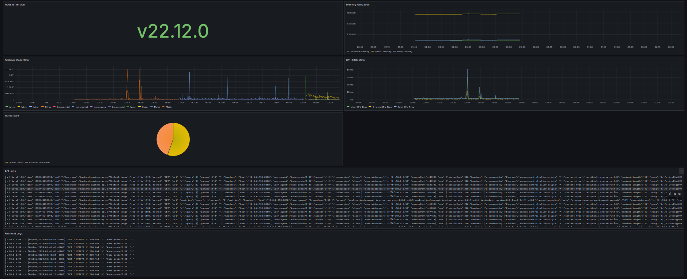
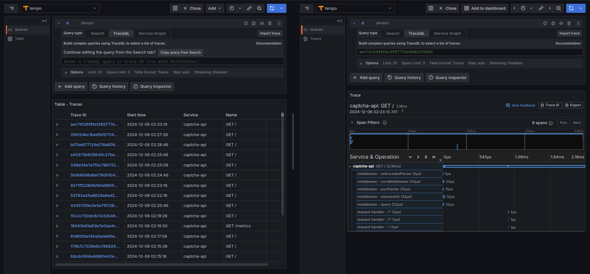
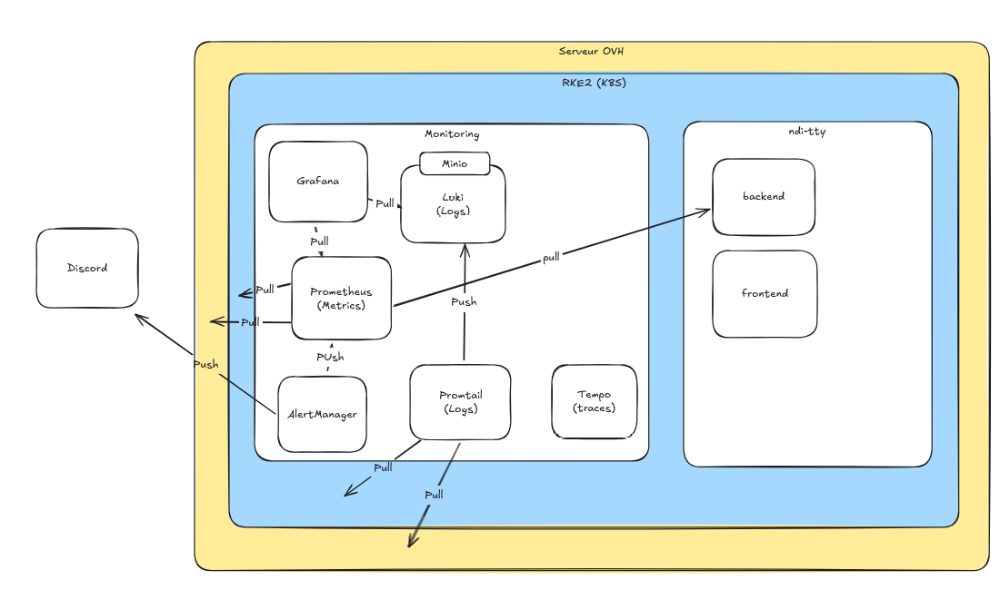

# Mets tes Binocles

## Introduction

Étant étudiants ingénieur DevOps, nous avons décidé de nous mesurer a vorte challenge de monitoring. Ainsi, nous vous presenterons la stack que nous avons mise en place.

## Stack Technique Applicative

- Frontend ReactJS
- Backend: Nestjs
- Base de données: PosgreSQL

Nous avons fait le choix de ces technologies car nous étions très familiers avec et qu'elles s'intégraient très bien a des solutions existantes de monitoring.

## Stack Technique de Monitoring

- Prometheus: Pour la collecte de métriques
- Loki: Pour la collecte de logs
- Tempo: Pour la collecte de traces
- Alertmanager: Pour la gestion des alertes
- Grafana: Pour la visualisation des métriques, logs et traces
- Matomo: Pour la collecte de données d'audience

Nous avons choisi ces technologies dues à leur popularité, leur intégration facile, leur documentation très complète et le fait qu'elles soient open-source.

## Stack Technique d'Infrastructure

- Docker: Pour la conteneurisation
- Kubernetes: Pour l'orchestration
- Helm: Pour le déploiement

Nous avons choisi ces technologies principalement car helm est un outil très puissant permettant en quelques lignes de commande de déployer des applications sur un cluster Kubernetes.

## Installation

Pour installer notre stack, il vous faut d'abbord un cluster Kuberentes. Nous vous suggérons également l'utilistation de nginx-ingress pour l'exposition de vos services et de cert-manager pour la gestion des certificats.

Ensuite, vous pouvez vous inspirer de notre fichier `kubernetes/helmfile.yaml` pour déployer notre stack.

```bash
helmfile -f kubernetes/helmfile.yaml apply
```

Cela va déployer `kube-prom-stack` qui est un ensemble de chart Helm qui déploie Grafana, Prometheus, Prometheus Node Exporter et AlertManager.

Il déploiera également `loki` qui permet d'aggreger les logs et `promtail` qui se charge de collecter les logs sur toutes les sources configurées et de les envoyer à Loki.

Enfin, il déploiera `tempo` qui permet de collecter les traces.

Notez que dans `kubernetes/values/grafana.yaml`, nous avons configuré Grafana pour qu'il utilise Loki et Tempo comme sources de données. Aucune configuration supplémentaire n'est nécessaire.

## Dashboard NDI

Nous avons créé un dashboard Grafana nommé `NDI TTY` qui permet de visualiser les métriques, logs et traces de notre application.

Voici l'accès:

- URL: `https://grafana.moreiradj.net/d/ae61uvigu2n7kb/ndi-tty?orgId=1&from=2024-12-05T19:40:57.116Z&to=2024-12-06T01:40:57.116Z&timezone=browser`
- Identifiants: `viewer` / `viewernditty`
- Dashboard: `NDI TTY`

En voici un appercu:



On retrouves :

- Version de NodeJS
- Utilistation mémoire
- Utilistation CPU
- Statistiques sur la résolution de "Où est charlie"
- Logs de l'API
- Logs du frontend

En explorant l'instance grafana, vous trouverez également d'autres dashboards telles que l'utilistation des PVC, l'utilistation des pods, etc.

Vous pouvez également explorer les logs et les traces depuis l'onglet `Explore` de Grafana.



Vous pouvez voir sur l'image précédente un exemple de trace.

Les traces peuvent être utiles pour comprendre le comportement de votre application et pour débugger des problèmes de performance ou de logique métier.

## Configuration Application NestJS

### Configuration de prometheus

Pour que votre application NestJS envoie des métriques à Prometheus, vous pouvez utiliser le module `@willsoto/nestjs-prometheus`.

```bash
pnpm install @willsoto/nestjs-prometheus prom-client
```

Ensuite, vous pouvez ajouter le module à votre application:

```typescript
import { Module } from '@nestjs/common';
import { PrometheusModule } from '@willsoto/nestjs-prometheus';

@Module({
  imports: [
    ...
    PrometheusModule.register({
      global: true,
      defaultLabels: {
        app: 'captcha-api', // nom de votre application
      },
    }),
    ...
  ],
  controllers: [],
  providers: [],
})
export class MainModule {}
```

Enfin, vous pouvez ajouter des compteurs à votre application:

```typescript
import { Module } from '@nestjs/common';
import {
  CHARLIE_SUCCESS_COUNTER,
  CHARLIE_FAIL_COUNTER,
  FLAPPY_BIRD_ATTEMPTS_COUNTER
} from 'src/config';

@Module({
  imports: [
    ...
  ],
  providers: [
    makeCounterProvider({
      name: CHARLIE_ATTEMPS_COUNTER,
      help: 'Number of "where is charlie" attemps',
    }),
    makeCounterProvider({
      name: CHARLIE_SUCCESS_COUNTER,
      help: 'Number of "where is charlie" successes',
    }),
    makeCounterProvider({
      name: CHARLIE_FAIL_COUNTER,
      help: 'Number of "where is charlie" failures',
    }),
  ],
})
export class WebsocketModule {}
```

Enfin, on peut injecter ces compteurs dans nos services:

```typescript
import {
  SubscribeMessage,
  WebSocketGateway,
  OnGatewayConnection,
  OnGatewayDisconnect,
  MessageBody,
  ConnectedSocket,
  WebSocketServer,
} from '@nestjs/websockets';
import { Server, Socket } from 'socket.io';
import { InjectMetric } from '@willsoto/nestjs-prometheus';
import {
  CHARLIE_ATTEMPS_COUNTER,
  CHARLIE_FAIL_COUNTER,
  CHARLIE_SUCCESS_COUNTER,
} from 'src/config';
import { Counter } from 'prom-client';

export enum Events {
  INIT_GAME = 'init-game',
  START_GAME = 'start-game',
  ERROR = 'error',
  SUBMIT_COORDONATES = 'submit-coordonates',
}

@WebSocketGateway({ cors: true, namespace: 'where-is-charlie' })
export class WhereIsCharlieGateway
  implements OnGatewayConnection, OnGatewayDisconnect
{
  ...

  constructor(
    @InjectMetric(CHARLIE_ATTEMPS_COUNTER)
    private attemptsCounter: Counter<string>,
    @InjectMetric(CHARLIE_SUCCESS_COUNTER)
    private successsCounter: Counter<string>,
    @InjectMetric(CHARLIE_FAIL_COUNTER)
    private failsCounter: Counter<string>,
  ) {
    this.games = new Map();
  }

  handleConnection() {
    this.logger.info('client connected');
  }

  ...

  @SubscribeMessage(Events.SUBMIT_COORDONATES)
  handleCoordonates(
    @MessageBody() data: Coordonate,
    @ConnectedSocket() client: Socket,
  ): ResultPayload {
    // return this.whereIsCharleyService.handleCoordonates(data, client);
    const game = this.games.get(client.id);
    if (!game) {
      client.emit(Events.ERROR, { message: 'No active game session!' });
      return;
    }

    const result = game.handleCoordonates(data, client);
    if (result.success) {
      this.successsCounter.inc(); // incrémenter success counter
    } else {
      this.failsCounter.inc(); // incrémenter fail counter
    }
    this.attemptsCounter.inc();
    return result;
  }

  ...
}
```

Ces métriques sont exposée sur `/metrics` par défaut.

Et pour collecter ces données dans kubernetes, il suffit d'utiliser le CRD `ServiceMonitor` de Prometheus Operator.

```yaml
apiVersion: monitoring.coreos.com/v1
kind: ServiceMonitor
metadata:
  name: mymonitor
spec:
  selector:
    matchLabels:
      app: captcha-api
  endpoints:
  - port: http
    path: /metrics
```

### Configuration de loki

Pour utiliser loki, vous n'avez pas besoin de faire grand chose. En effet, promtail extrait les logs du container via le CRI (en général containerd) et les envoie à loki.

Cependant, il est quand même plus élégant de logger dans un format JSON pour que loki puisse indexer correctement les logs.

Pour cela nous avons utilisé le module `@nestjs/pino` qui permet de logger en JSON.

### Configuration des traces

```bash
pnpm install @opentelemetry/sdk-node @opentelemetrysdk-trace-base # core
pnpm install @opentelemetry/instrumentation-express @opentelemetry/instrumentation-http # express instrumentation
pnpm install @opentelemetry/instrumentation-nestjs-core # nestjs instrumentation
pnpm install @opentelemetry/semantic-conventions @opentelemetry/resources # conventions
pnpm install @opentelemetry/exporter-jaeger # jaeger exporter (supported by tempo)
```

Ensuite, vous pouvez ajouter le module à votre application:

```typescript
// tracing.ts
import { SimpleSpanProcessor } from '@opentelemetry/sdk-trace-base';
import { NodeSDK } from '@opentelemetry/sdk-node';
import * as process from 'process';
import { HttpInstrumentation } from '@opentelemetry/instrumentation-http';
import { ExpressInstrumentation } from '@opentelemetry/instrumentation-express';
import { NestInstrumentation } from '@opentelemetry/instrumentation-nestjs-core';
import { Resource } from '@opentelemetry/resources';
import { SemanticResourceAttributes } from '@opentelemetry/semantic-conventions';
import { JaegerExporter } from '@opentelemetry/exporter-jaeger';

const jaegerExporter = new JaegerExporter({
  endpoint: process.env.JAEGER_ENDPOINT,- // endpoint de tempo
});

const traceExporter = jaegerExporter;

export const otelSDK = new NodeSDK({
  resource: new Resource({
    [SemanticResourceAttributes.SERVICE_NAME]: `captcha-api`, // nom de l'appli
  }),
  spanProcessor: new SimpleSpanProcessor(traceExporter),
  instrumentations: [
    new HttpInstrumentation(),
    new ExpressInstrumentation(),
    new NestInstrumentation(),
  ],
});

// gracefully shut down the SDK on process exit
process.on('SIGTERM', () => {
  otelSDK
    .shutdown()
    .then(
      () => console.log('SDK shut down successfully'),
      (err) => console.log('Error shutting down SDK', err),
    )
    .finally(() => process.exit(0));
});
```

Ensuite, vous pouvez charger l'instrumentation dans votre application:

```typescript
// main.ts
...
await otelSDK.start();
...
```

Comme NodeJS est un langage interprété, l'instrumentation est facile à mettre en place.

Enfin il n'y a plus que déployer l'application dans kubernetes et configurer l'url de tempo avec la variable d'environnement `JAEGER_ENDPOINT`.

Si vous avez suivi nos étapes, l'url devrait être `http://tempo.monitoring.svc.cluster.local:14268/api/traces`.

### Configuration Matomo

Nous avons également installé matomo, une version open-source de Google Analytics.

Pour l'installer, il suffit de déployer le chart Helm `matomo`:

```bash
helmfile sync -f kubernetes/helmfile.yaml --selector name=matomo # modifier `kubernetes/values/matomo.yaml` pour configurer l'application
```

Ensuite, vous pouvez accéder à l'interface web de matomo pour configurer votre site web et obtenir le code de tracking. Comme notre appli est une application React, nous avons ajouté le code de tracking à la racine de notre application.

```ts
function App() {
  useEffect(() => {
    // @ts-expect-error matomo
    // eslint-disable-next-line no-var
    var _mtm = (window._mtm = window._mtm || []);
    _mtm.push({ "mtm.startTime": new Date().getTime(), event: "mtm.Start" });

    // eslint-disable-next-line no-var
    var d = document,
      g = d.createElement("script"),
      s = d.getElementsByTagName("script")[0];
    g.async = true;
    g.src = "https://matomo.moreiradj.net/js/container_ZetIg1f3.js";
    // @ts-expect-error matomo
    s.parentNode.insertBefore(g, s);
  }, []);
  return <RouterProvider router={router} />;
}
```

Du côté de matomo, nous avons configuré un tableau de bord pour suivre:

- les visites
- les changements de pages
- les clics

Nous pouvons ainsi avoir accès à des dashboards pour suivre l'audience de notre application. (malhereusement, nous n'avons pas énormément de données pour le moment).

Vous pouvez y accéder à l'addresse `https://matomo.moreiradj.net/index.php?module=CoreHome&action=index&date=yesterday&period=day&idSite=2#?period=day&date=yesterday&idSite=2&category=Dashboard_Dashboard&subcategory=1` avec les identifiants que nous pouvons vous communiquer par mail via `martin.moreira-de-jesus@protonmail.com`.

## Architecture



Voici l'architecture finale de la stack de monitoring.

## Conclusion

Il est très important de monitorer son application pour s'assurer de sa disponibilité et de sa performance. Nous avons vu comment mettre en place une stack de monitoring complète avec Prometheus, Loki, Tempo et Grafana sans friction.

Nous avons également vu comment configurer une application NestJS pour qu'elle envoie des métriques à Prometheus, des logs à Loki et des traces à Tempo.

Nous espérons que ce document vous a été utile et que vous avez apprécié notre stack de monitoring.

N'hésitez pas à nous contacter si vous avez des questions ou des suggestions.

Merci de votre attention.
