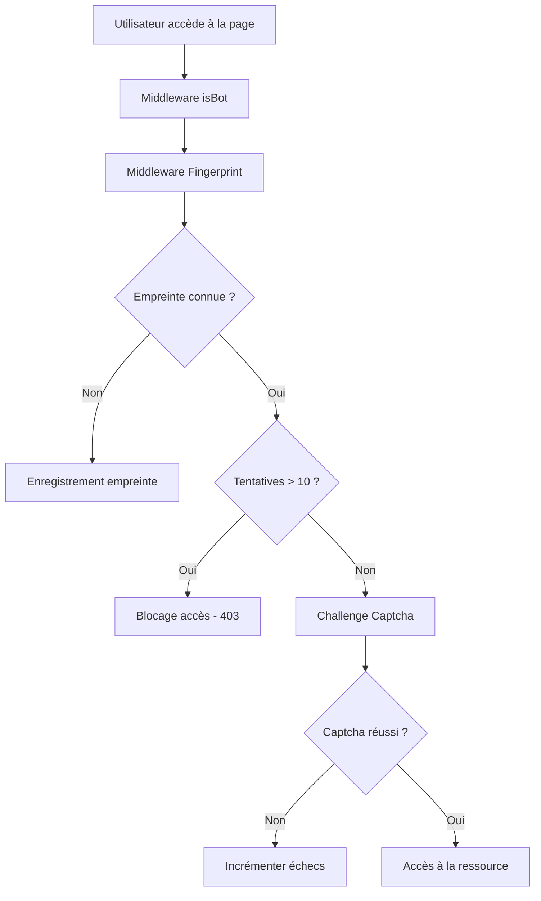

# Workflow d'accès sécurisé via Captcha gamifié avec NestJS

## Étape 1: Accès à la page protégée
1. **Utilisateur accède à la page web.**
    - Requête HTTP envoyée vers le serveur backend.

## Étape 2: Interception par un Middleware "Fingerprint"
2. **Appel du middleware `Fingerprint`.**
    - Récupération des cookies ou headers pour obtenir l'empreinte unique de l'utilisateur.
    - Si l'empreinte n'existe pas, elle est générée en fonction de données client-side (User-Agent, IP, etc.).

## Étape 3: Vérification en Base de Données
3. **Le middleware vérifie l'empreinte en base de données.**
    - **Scénario A : Empreinte inconnue.**
        - Enregistrement de la nouvelle empreinte.
        - Génération d’un cookie sécurisé contenant :
            - Un ID unique.
            - Un timestamp d'expiration.
        - Envoi du cookie à l'utilisateur avec les headers sécurisés (`HttpOnly`, `Secure`, `SameSite=Strict`).

    - **Scénario B : Empreinte connue.**
        - Vérification du nombre d’échecs de captcha associés à cette empreinte.
        - **Si `échecs > 10` :**
            - **Blocage de l'accès.**
            - Retour d'une réponse HTTP `403 Forbidden` avec un message d'erreur.
        - **Sinon :** passage à l’étape suivante.

## Étape 4: Validation du Captcha
4. **L'utilisateur doit résoudre un captcha gamifié.**
    - Le backend génère et envoie le challenge captcha.
    - **Si l'utilisateur réussit :**
        - Mise à jour des tentatives en base.
        - Accès accordé à la ressource.
    - **Si l'utilisateur échoue :**
        - Incrémentation du compteur d’échecs.
        - Renvoi d’un nouveau challenge ou blocage selon le nombre d’échecs.

## Étape 5: Accès à la ressource
5. **Accès aux ressources protégées.**
    - En cas de succès du captcha, le backend délivre les ressources demandées.

## Diagramme Simplifié

