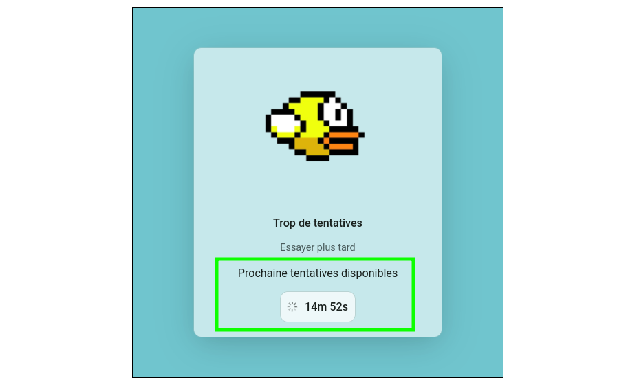

# VIVERIS : les CAPTCHA(s) ludique (NATIVE DEVELOPEMENT)

Avant de commencer à lire ce document, nous vous recommandons de consulter la documentation Markdown pour une meilleure expérience de lecture ainsi que la vidéo de présentation du projet.

**Accéder au site web** :
[Visitez le site web CAPTCHA](https://ndi-tty.moreiradj.net/captcha)

**Documentation GITHUB (Markdown)**: 
[La documentation Markdown](https://github.com/ndi-tty/ndi-2024-rendu/blob/main/frontend/CAPTCHA.md)

**Vidéo de présentation** :
[Regardez la vidéo de présentation](https://www.youtube.com/watch?v=VM0f2FSM4v8)

## Table des matières

> - [Introduction](#introduction)
> - [Objectifs](#objectifs)
> - [Le choix des jeux](#le-choix-des-jeux)
>   * [Où est Charlie ?](#où-est-charlie-)
>   * [Flappy Bird](#flappy-bird)
> - [La stack technique](#la-stack-technique)
>   * [La code base](#la-code-base)
>   * [L'infrastructure](#linfrastructure)
> - [La sécurité : processus de validation des CAPTCHAs](#la-sécurité--processus-de-validation-des-captchas)
>     + [Étape 1: Accès à la page protégée](#étape-1-accès-à-la-page-protégée)
>     + [Étape 2: Interception par un Middleware "Fingerprint"](#étape-2-interception-par-un-middleware-fingerprint)
>     + [Étape 3: Vérification en Base de Données](#étape-3-vérification-en-base-de-données)
>     + [Étape 4: Validation du Captcha](#étape-4-validation-du-captcha)
>     + [Étape 5: Accès à la ressource](#étape-5-accès-à-la-ressource)
>   * [Surveillance et Analyse](#surveillance-et-analyse)
>   * [Diagramme Simplifié](#diagramme-simplifié)
> - [Axes d'améliorations](#axes-daméliorations)

## Introduction

En cette année 2024, l’équipe TTY est de retour sur le défi **VIVERIS** ET se confronte une nouvelle fois au défi captivant proposé. Ce challenge, alliant technique et créativité, a retenu notre attention pour sa combinaison UX/UI et sécurité web. En décomposant le titre « Game Tcha », nous pouvons voir qu’en réalité le sujet met en lumière deux aspects distincts :

1. **La Gamefication:**  centré sur la conception d’un mini-jeu interactif et ludique, visant à transformer les CAPTCHAs traditionnels en une expérience utilisateur captivante et divertissante.

2. **Le Captcha:** quant à lui, met l’accent sur les aspects techniques des CAPTCHAs, leur importance dans la sécurité web et leur capacité à différencier les utilisateurs humains des robots.

## Objectifs

**Les objectifs de ce projet sont les suivants :**

Concevoir un CAPTCHA à la fois ludique et interactif nécessite de trouver un équilibre entre son efficacité en tant qu’outil anti-bot et une expérience utilisateur plaisante. Ce projet nous a permis de revisiter un concept classique pour le rendre plus amusant, tout en approfondissant notre compréhension des mécanismes de sécurité qui sous-tendent les CAPTCHAs.

## Le choix des jeux

Pour relever ce défi, nous avons réfléchi au type de jeu qui serait à la fois ludique pour les utilisateurs et efficace pour distinguer un humain d’un robot, mélan sécurité et amusement.

Cloudflare Turnstile utilise une simple case à cocher pour **analyser les mouvements de souris**. De son côté, le reCAPTCHA de Google utilise une analyse d’images, invitant les utilisateurs à identifier des éléments visuels (comme des passages piétons ou des voitures). Bien que ces approches diffèrent dans leur présentation, elles reposent toutes deux sur la détection des mouvements de souris pour évaluer la probabilité qu’un utilisateur soit humain. 

Partant de ce constat, nous avons conçu deux jeux pour aller plus loin dans l’analyse des comportements humains.  

1. **“Où est Charlie ?”** : Ce jeu exige observation et précision pour trouver un personnage caché, mobilisant des compétences naturelles (irrégulières) aux humains mais difficiles à imiter pour un robot.Trouver un personnage caché parmi d’autres éléments visuels demande une capacité cognitive et une attention que les robots ont du mal à imiter, ce qui en fait un bon choix pour distinguer les humains des robots.
 

2. **“Flappy Bird”** : Ce défi teste la coordination et la réactivité à travers des obstacles imprévisibles, s’appuyant sur des capacités motrices humaines complexes (irrégulières) à reproduire par une machine. Ces choix permettent une distinction claire entre humains et robots tout en offrant une expérience ludique.Cela nous a naturellement conduit à choisir **Flappy Bird** comme deuxième jeu. Avec sa mécanique simple mais exigeante, ce jeu permet de tester la réactivité et la coordination des utilisateurs tout en offrant une expérience ludique.

### Où est Charlie ?

L’objectif est simple : trouver Charlie, reconnaissable grâce à ses lunettes et son bonnet rayé rouge et blanc. 

1. Les règles sont les suivantes :

Vous avez trois essais pour **cliquer sur la tête de Charlie.** Sinon, vous devrez recommencer. Un chronomètre de 180 secondes démarre dès le début de la partie: 

Si vous réussissez : 

Dans le cas contraire : 

2. Deux modes de jeu sont disponibles :

**Mode normal :** La totalité de l’image est visible, ce qui permet une recherche sans contraint : 

**Mode hardcore :** La visibilité est restreinte à une petite zone autour du curseur de la souris. Trouver Charlie dans ce mode nécessite de déplacer le curseur pour explorer l’image progressivement.

### Flappy Bird

L'objectif est simple : voler le plus loin possible en évitant les tuyaux.

1. Les règles sont les suivantes :

Vous devez présser la barre d'espace pour faire voler l'oiseau et éviter les tuyaux. Si vous touchez un tuyau, vous perdez et devez recommencer : 

Si vous échouez 10 fois, le jeu sera innaccessible pour une durée de 15 minutes :

Pour réussir vous devez atteindre un score de **1250 points** avec un maximum de 10 essais, si vous vous serez redirigé vers la page captcha : 

## La stack technique

### La code base

1. Frontend (SPA) : REACT 
2. Backend : NestJS

### L'infrastucture
3. Base de données : PostgreSQL
4. Communication : WebSocket (Socket.io)
4. Déploiement local : Docker compose  
5. Déploiement en production : Kubernetes (OVH)

## La sécurité : processus de validation des CAPTCHAs

---

#### Étape 1: Accès à la page protégée
1. **Utilisateur accède à la page web.**
Une connexion **websocket** est établie entre le client et le serveur.

---

#### Étape 2: Interception par un Middleware "Fingerprint" && "isBot"

2. **Appel du middleware `Fingerprint` && `isBot`.**
    Recupération du headers pour obtenir l'empreinte unique de l'utilisateur.
    Le frontend et le backend utilisent le package `isBot` pour détecter une liste de bots connus.

- NPM Package : [isBot](https://www.npmjs.com/package/isbot)

---

#### Étape 3: Vérification en Base de Données
3. **Le middleware vérifie l'empreinte en base de données.**
    - **Scénario A :** Empreinte inconnue.
    Si l'empreinte n'existe pas, elle est générée en fonction de données client-side (User-Agent, IP, etc.).
    - **Scénario B : Empreinte connue.**
        - Vérification du nombre d’échecs de captcha associés à cette empreinte.
        - **Si `échecs > 10` :**
            - **Blocage de l'accès (flappy bird).**
        - **Sinon :** passage à l’étape suivante.

- Custom Middleware : 

- Empreinte en base de données :

---

#### Étape 4: Validation du Captcha
4. **L'utilisateur doit résoudre un captcha gamifié.**
    - Le backend génère et envoie le challenge captcha.
    - **Si l'utilisateur réussit :**
        - Mise à jour des tentatives en base.
    - **Si l'utilisateur échoue :**
        - Incrémentation du compteur d’échecs.
        - Renvoi d’un nouveau challenge ou blocage selon le nombre d’échecs.

- Echecs et tentatives en base de données :

#### Étape 5: Accès à la ressource
5. **Accès aux ressources protégées.**
    - En cas de succès des captchas, le backend délivre un cookie d’authorisation = l'utilisateur est authaurisé à accéder à la ressource protégée.
---

### Surveillance et Analyse

Nous avons mis en place des outils de surveillance et d'analyse pour suivre les performances et l'utilisation des CAPTCHAs :
- **Logs et Monitoring** : Nous avons mis place des outils de monitoring pour suivre les performances du backend et détecter les anomalies.
- **Analyse des Données** :Nous collectons et analysons les données d'utilisation pour identifier les points de friction et améliorer continuellement l'expérience utilisateur.

Notre dashboard de `traces` :

Notre dashboard de `monitoring` :

### Diagramme : MERMAID

## Axes d'améliorations

### Développement Backend en RUST

Le développement d'un backend en RUST pourrait être une amélioration significative pour plusieurs raisons :
- **Performance** : RUST est connu pour ses performances élevées et son faible temps de latence, ce qui pourrait améliorer la réactivité du système de validation des CAPTCHAs.
- **Sécurité** : RUST offre des garanties de sécurité mémoire, réduisant ainsi les risques de vulnérabilités telles que les dépassements de tampon.
- **Concurrence** : RUST permet une gestion efficace de la concurrence, ce qui pourrait être bénéfique pour gérer un grand nombre de connexions WebSocket simultanées.

### Amélioration de l'UI/UX

Bien que nous nous soyons concentrés principalement sur la partie backend, l'amélioration de l'UI/UX pourrait rendre l'expérience utilisateur plus agréable et intuitive :
- **Design Responsive** : Assurer que l'interface utilisateur est optimisée pour tous les types d'appareils (ordinateurs de bureau, tablettes, mobiles).
- **Feedback Utilisateur** : Ajouter des animations et des messages de feedback pour guider l'utilisateur à travers le processus de validation des CAPTCHAs.
- **Accessibilité** : Veiller à ce que l'application soit accessible aux utilisateurs ayant des besoins spécifiques, en suivant les directives d'accessibilité du Web (WCAG).

### Optimisation des Jeux

Les jeux CAPTCHA peuvent être optimisés pour offrir une meilleure expérience utilisateur et une meilleure détection des bots :
- **Niveaux de Difficulté** : Introduire des niveaux de difficulté progressifs pour rendre les jeux plus engageants.
- **Analyse Comportementale** : Utiliser des techniques d'apprentissage automatique pour analyser les comportements des utilisateurs et améliorer la détection des bots.
